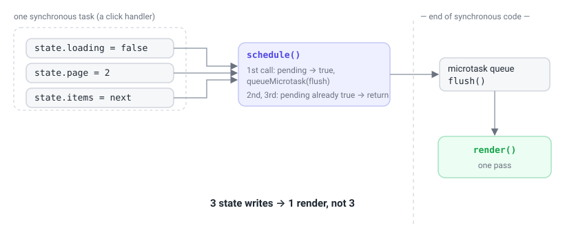
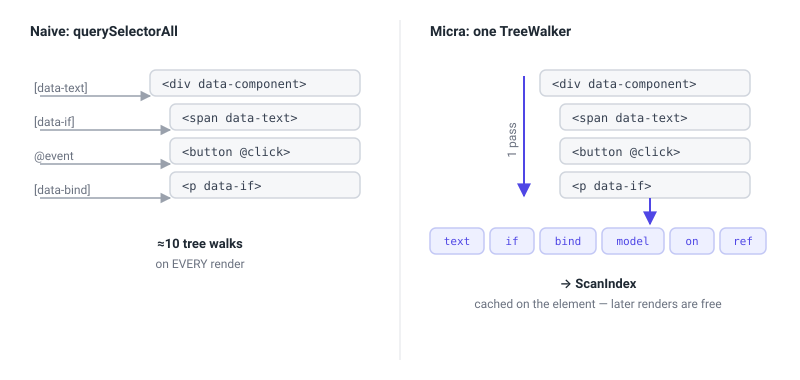
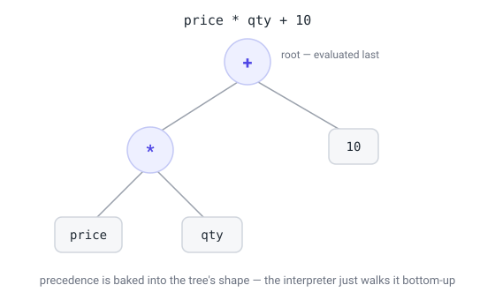
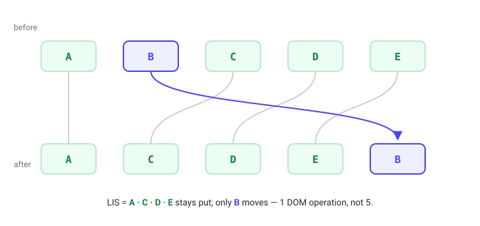

# Micra.js under the hood: how a reactive framework fits in 7 kilobytes

This is a long read about how Micra.js works on the inside — a tiny library that adds reactivity to HTML rendered on the server. I built it to fill one specific niche: pages and admin panels where the server already ships ready-made markup and the client only needs a little interactivity — switch a tab, open a modal, filter a table, fetch some data. People used to reach for jQuery for this, then for Alpine. Micra is an attempt to give you the same "sprinkle" of reactivity, but predictably, with types, and with Content-Security-Policy in mind.

In this article I want to talk about the engineering: what happens under the hood, why it's done this way, and which concepts from "big" programming hide behind each module. Along the way I'll try to explain things like microtasks, the abstract syntax tree, and the longest-increasing-subsequence algorithm.

## The core idea: animate markup, don't build it

Before we look at any code, there's one decision that everything else follows from. Micra doesn't build the DOM. It _finds_ it. You write ordinary HTML — by hand or from a server template engine — and sprinkle directive attributes onto it:

```html
<div data-component="counter">
  <button @click="decrement">−</button>
  <strong data-text="count"></strong>
  <button @click="increment">+</button>
</div>
```

When the page has loaded, you call `Micra.start()`. It scans the document, finds elements with `data-component`, and for each one creates an "instance" — an object with state and methods, bound to that piece of markup. From then on Micra watches the state and updates only the nodes that need it.

React and frameworks like it go the opposite way: the markup is the _result_ of running JavaScript, the tree lives in memory as a virtual DOM, and the HTML is just its projection. That's powerful, but expensive — you need a bundler, a runtime weighing tens of kilobytes, and you need the _entire_ UI to pass through JS. That's justified for a full SPA. But for small sites, simple SaaS, or admin panels it's complete overkill.

So Micra's job is to "animate server HTML" by adding a bit of dynamic change. Imagine adding search to your blog, a collapsible navigation panel, or a modal dialog. For cases like these you often want something lighter than React.

The "animate server HTML" principle also dictates the size budget. I initially tried to fit everything into 5 kilobytes. In the course of development I had to move toward 7 kilobytes gzipped. Almost every decision below was made with an eye on the byte count, and I worked hard to make "small" and "correct" line up.

## The map

Micra is a handful of tiny modules, each doing one thing:

- **reactive state** — a `Proxy` that notices writes to `state`;
- **scheduler** — collects a batch of changes into a single render pass;
- **scanner** — one tree walk that finds all directives and caches them;
- **directives** — functions that read state and write to the DOM;
- **expression evaluator** — turns strings like `count > 0` into values without `eval`;
- **list rendering** — keyed diff for `data-each`;
- **events** — binding `@click`, modifiers, automatic cleanup;
- **event bus** — communication between components;
- **fetch, lifecycle, types** — the wrapping around the core.

When you write `this.state.count++`, here's the chain: the `Proxy` catches the write and tells the scheduler "a render is needed"; the scheduler queues a single microtask; in that microtask `render()` runs, takes the cached scan result, runs the directives over it, they evaluate expressions and update the DOM. Let's take apart each link.

## Reactivity: why `Proxy`, and why "shallow"

Reactivity is when you change data and the UI updates itself. For that to work, the library needs to _learn_ that the data changed. There are two ways. You can require a special function call (`setState`, `this.set`) — then the library learns about the change at the moment of the call. Or you can intercept the assignments themselves, so that `this.state.count = 5` works like ordinary JavaScript but secretly pulls the right lever. Micra takes the second route, and the tool for it is `Proxy`.

A `Proxy` is a wrapper object around another object. You define "traps" on operations: reading a property, writing, deleting. When someone touches the wrapper, your trap runs instead of the default behavior. The entire reactive layer of Micra is, literally, a few lines:

```ts
export function createReactiveState(obj, schedule, onKey) {
  return new Proxy(obj, {
    set(target, key, value) {
      target[key] = value; // do the ordinary write
      onKey?.(key); // remember which key changed
      schedule(); // ask for a re-render
      return true;
    },
  });
}
```

Only `set` is intercepted. Reads pass straight through — that matters for speed: on the hot path (when directives read state dozens of times per render) there's no wrapper at all.

The trap sits only on the top level of the object. That's the **shallow** part. It means this updates the UI:

```ts
this.state.user = { ...this.state.user, name: "Ann" }; // write to state.user — trap fired
```

and this doesn't:

```ts
this.state.user.name = "Ann"; // write to user.name, not state.user — trap stays silent
```

In the second case we're writing into the _nested_ object `user`, and `Proxy` never wrapped it — it only wrapped `state`.

Why not make reactivity deep, so that anything at any nesting level is tracked? Because it's expensive. First, in size and speed: you'd have to recursively wrap each nested object in its own `Proxy`, create them lazily on access, and keep track of the links. Second, in predictability: deep proxies breed bugs when the same object lives in two places in the state, or when you pass a slice of state into an external function and lose reactivity. The shallow model is more honest: "only writes to the top level of `state` are reactive; want to update something nested — replace the top-level key wholesale." It's the same immutability discipline React arrived at with its `setState({ ...prev })`.

To remove the pain of "flattening" nested objects by hand on every form input, there's some syntactic sugar — `this.set('user.name', x)` and `data-model="user.name"`. Underneath sits the `setPath` function, which does exactly what you'd write by hand: it rebuilds the chain of nested objects and reassigns the top-level key.

```ts
export function setPath(state, path, value) {
  const parts = path.split("."); // 'user.address.city' → ['user','address','city']
  const top = parts[0];
  if (parts.length === 1) {
    state[top] = value;
    return;
  } // flat path — an ordinary write
  const root = { ...state[top] }; // copy the top-level object
  let cur = root;
  for (let i = 1; i < parts.length - 1; i++) {
    cur = cur[parts[i]] = { ...cur[parts[i]] }; // copy each intermediate level
  }
  cur[parts[parts.length - 1]] = value; // write the deepest one
  state[top] = root; // ← this write is what wakes the Proxy
}
```

Notice: the last line writes to `state[top]` — the top level. That's what triggers a single render. This is sugar over shallow reactivity. The difference is fundamental: we don't pay to track the whole tree, we just automate the correct immutable update.

## Scheduler: why one render per batch of changes

Say in a handler you write three times in a row:

```ts
this.state.loading = false;
this.state.page = 2;
this.state.items = nextItems;
```

The naive reaction is to repaint the UI three times. That's both slow and produces visible "flicker" of intermediate states. The right thing is to collect all synchronous changes into a single batch and repaint once, when the call stack empties. For that you need a scheduler, and this is where **microtasks** come on stage.

The browser event loop works like this: there are macrotasks (a click handler, a timer, a network response) and microtasks (the things `Promise.then` and `queueMicrotask` queue). After the current macrotask has run its synchronous code to the end, the browser _fully_ drains the microtask queue — and only then, possibly, repaints the screen. So a microtask is the ideal place for "defer until the end of the current code, but make it before paint."

Micra's scheduler uses this directly:

```ts
export function createScheduler(render) {
  let pending = false;
  const flush = () => {
    pending = false;
    render();
  };
  return function schedule() {
    if (pending) return; // a render is already queued — bail out
    pending = true;
    queueMicrotask(flush); // one microtask for the whole batch
  };
}
```

The first write to state raises the `pending` flag and queues a microtask. The second and third see the raised flag and just bail. When the handler's synchronous code finishes, the browser runs the single microtask, `flush` lowers the flag and calls `render()` once. Three writes — one render. No timers, no extra promise allocations, no strings attached.



## Scanner: one walk instead of ten

When it's time to render, you need to know _where_ in the markup the directives live — which elements have `data-text`, which have `data-if`, which have `@click`. The simple solution is `querySelectorAll('[data-text]')`, `querySelectorAll('[data-if]')`, and so on: a dozen tree walks per render. But that's wasteful, especially when there are many renders.

Micra walks a component's subtree exactly once — via `TreeWalker`, the low-level browser iterator over nodes. In a single pass, the `classify` function looks at each element's attributes and sorts it into "buckets": text bindings into one, conditions into another, events into a third. The result — a `ScanIndex` object — is cached right on the component's root element (`el.__micraScan`). The first render pays for the walk; every render after that takes the ready-made index and doesn't touch the DOM tree at all.

The classification hides two nice little touches. The first is a check on the char code of the attribute's first character:

```ts
const first = name.charCodeAt(0);
if (first === 64 /* '@' */) {
  /* this is an event */
}
if (first === 100 /* 'd' */ && name.charCodeAt(4) === 45 /* '-' */) {
  /* this is data-* */
}
```

Most attributes (`id`, `class`, `href`) aren't ours. Comparing a single number rejects them with no string-comparison overhead.

The second: `TreeWalker` is configured to return `FILTER_REJECT` on any nested `data-component`. That means a parent component doesn't even _enter_ its children's subtrees: each component owns only its own directives. The result is a kind of free isolation.

On top of that, `TreeWalker` doesn't descend into `<template>` content by default — which is exactly what we want, because list rows live in `template.content` and are handled by a separate module.



## Directives: read state, write to the DOM

A directive is a small pure function: "read state, update one aspect of the DOM." `data-text` sets `textContent`, `data-show` toggles `style.display`, `data-bind` sets attributes, `data-class` toggles classes. They're all trivial, except for two places where a characteristic decision hides.

The first is `data-if`. It doesn't hide the element via `display: none` — it _physically removes_ it from the tree, leaving an empty comment placeholder in its place; when the condition becomes truthy again, the element returns to the placeholder's spot. The point is that an element hidden via CSS is still in the accessibility tree: screen readers see it, tab focus can land in it, its child components stay alive and burn resources. `data-if` removes the node for real. And when you specifically want a cheap visual toggle without removal — there's `data-show`.

The second is the semantics of `data-bind`. Here it's important to distinguish value types. If the expression returns a boolean `true`/`false`, the attribute is treated as present/absent. That's how real boolean HTML attributes like `disabled` and `hidden` work. If a string is returned, it's set as-is. The catch is that ARIA states are _not_ boolean HTML attributes: `aria-expanded` must contain the literal string `"true"` or `"false"`, and an empty `aria-expanded=""` or a missing attribute mean something different to a screen reader. So a bare boolean here is a bug:

```html
<!-- Bug: open === true → aria-expanded="" ; open === false → attribute removed -->
<button data-bind="aria-expanded: open">…</button>

<!-- always a string: "true" or "false" -->
<button data-bind="aria-expanded: open ? 'true' : 'false'">…</button>
```

## The expression evaluator without `eval`

In directives you write JavaScript-like expressions: `data-if="count > 0"`, `data-text="formatDate(user.createdAt)"`, `data-class="active: tab === 'home'"`. Something has to turn these _strings_ into _values_. The simplest way is `new Function('count', 'return count > 0')` or `eval`. That's exactly what Alpine, for example, does. And it's exactly why Alpine doesn't work under a strict Content-Security-Policy.

CSP is a header by which the server tells the browser what code it's allowed to execute. A strict policy of `default-src 'self'` without `'unsafe-eval'` forbids `eval` and `new Function` entirely: any attempt to turn a string into executable code fails with an error. So `eval` is out. And if it's out, you have to write your own expression evaluator. This is the most complex module in the library, and it consists of the three classic stages of any interpreter: tokenizer, parser, interpreter.

### Tokenizer: string → stream of tokens

The tokenizer (a.k.a. lexer) breaks the string into "tokens" — indivisible pieces: numbers, strings, identifiers, operator signs. The expression `price * qty` becomes the stream `[id "price", punct "*", id "qty"]`. It's tedious but necessary work: the parser then finds it easier to work with a stream of meaningful tokens than with characters. Micra's tokenizer is a single `while` loop over the string's characters: see a quote — collect a string up to the closing one; see a digit — collect a number; see a letter — collect an identifier; otherwise look for the longest matching operator sign.

### The abstract syntax tree

Before we talk about the parser, we need to explain what it builds — the abstract syntax tree (AST). It's a representation of an expression as a tree, where each node is an operation or a value, and the links reflect structure and precedence. Take `price * qty + 10`. We know from school that multiplication binds "tighter" than addition, so the expression means `(price * qty) + 10`. The AST encodes that explicitly:



The root of the tree is the addition, because it's evaluated last (at the very top level). Its left child is the multiplication, its right child is the literal `10`. Once the tree is built, evaluating the expression is easy: just walk it recursively, bottom-up. There are no precedences left to remember — they're already "stored" in the shape of the tree.

That's why parsing and evaluation are two separate stages: the parser sorts out precedence once and builds the tree, and the interpreter then walks it as many times as you like. In Micra the tree nodes are described by a compact type: literal, identifier, member access (`mem`), call (`call`), unary operation (`un`), binary (`bin`), ternary (`tern`).

### Parser: why Pratt

The parser turns the flat stream of tokens into a tree, placing precedence correctly.

The naive way is recursive descent with one function per precedence level: `parseTernary` calls `parseOr`, which calls `parseAnd`, which calls `parseEquality`, which calls `parseComparison`, which calls `parseAddition`, which calls `parseMultiplication`, which calls `parseUnary`. Seven precedence levels — seven nearly identical functions, each differing from its neighbor only by its list of operators and who it calls below. It works, but there's a lot of nearly duplicated code. And that risks blowing past the 7 KB budget.

Pratt parsing (in its "precedence climbing" variant) folds all those levels into one function, parameterized by a minimum precedence. The idea lives in a table: each binary operator is assigned a number — its "binding power."

```ts
const BIN_PREC = {
  "||": 1,
  "&&": 2,
  "==": 3,
  "!=": 3,
  "===": 3,
  "!==": 3,
  "<": 4,
  "<=": 4,
  ">": 4,
  ">=": 4,
  "+": 5,
  "-": 5,
  "*": 6,
  "/": 6,
  "%": 6,
};
```

And the entire logic for parsing binary operations fits in one loop:

```ts
function parseBin(minPrec) {
  let left = parseUnary();
  for (;;) {
    const t = peek();
    const prec = t ? BIN_PREC[t.v] : undefined;
    if (prec === undefined || prec < minPrec) break; // operator too "weak" — stop
    next();
    const right = parseBin(prec + 1); // parse the right side at a higher precedence
    left = { k: "bin", op: t.v, l: left, r: right };
  }
  return left;
}
```

Read this loop slowly — it holds the whole idea. We parse the left operand, then look at the next operator. If its precedence is below the `minPrec` bar, we stop and hand what we've collected upward (a weaker operator out there will take us as its left operand). If it's higher or equal, we "eat" the operator and recursively parse the right side, but now with the bar at `prec + 1`. That `+ 1` is what makes operators left-associative: `a - b - c` is assembled as `(a - b) - c`, not `a - (b - c)`. One loop with a table replaces seven functions, extends trivially (adding an operator is one row in the table), and weighs a handful of bytes.

### Interpreter and the security model

Once the tree is built, the interpreter walks it recursively: a literal returns its value, a binary node evaluates the left and right branches and applies the operation, a ternary picks a branch, and so on. The logical `&&` and `||` are short-circuiting — like in real JS, they return the operand's value.

But what's more interesting isn't _what_ the interpreter can do, but what it fundamentally _can't_. When an expression mentions a bare identifier — say, `count` — the interpreter looks it up in a strictly defined order: first in the component's state, then in a whitelist of safe globals (`Math`, `JSON`, `Date`, `String`, `Number`…). If the name is in neither — it resolves to `undefined`. That means `window`, `document`, `fetch`, `eval` are unreachable **by construction**. We didn't hide them or shadow them — there's simply no scope where they exist for an expression. No variable, no access.

The classic prototype-escape trick is closed off separately: `item.constructor.constructor("…")()` — the chain that in old eval-based engines let you reach the `Function` constructor and execute arbitrary code, bypassing everything. On member access the interpreter refuses the names `__proto__`, `constructor`, `prototype`. To be honest, it's worth stressing: method calls still execute real JS — if _your_ method touches `window`, it will. Directive templates are trusted code that you write; the protection here is to keep an _expression in markup_ from accidentally or maliciously reaching a dangerous global, not a sandbox for someone else's code.

### Two-tier cache

Parsing a string into a tree isn't free, and doing it on every render would be silly. So the result is cached by the expression string itself. But there's a subtler optimization too: the overwhelming majority of expressions in real templates are simple paths like `count`, `user.name`, `item.email`. For those there's no point running the tokenizer and parser. A regex recognizes a "simple path," and then the expression is stored just as an array of parts `['user', 'name']`, and evaluation is a walk over the object. A full AST is built only for actual expressions with operations. So the hot path stays cheap, and the heavy machinery kicks in only when it's truly needed.

## How expressions see both state and methods

Derived values — counters, totals, filtered subsets — aren't stored in state in Micra; they're computed by methods. `data-text="totalCount()"` calls the `totalCount` method. For that to work, an expression has to see not only `state` but also the component's methods. That's handled by `exprState` — a `Proxy` that on read first returns the state's own keys, and if they're absent, returns the component's method, having first bound `this` to it (so that inside the method `this.state` works as expected). Bound copies of methods are memoized so repeated reads are cheap. Another perimeter is closed off here too: names from `Object.prototype` (`constructor`, `toString`, and the rest) are unreachable via an expression — you get `undefined`, not a leaked prototype.

Why are derived values methods, not state fields? Because a field is a second source of truth that will, sooner or later, drift from the first. If you store both `todos` and `todosCount`, then any code that forgets to update the counter breeds a bug. A method, on the other hand, is computed on read and is always consistent. And the expression cache plus batched rendering make repeated calls cheap enough that this purity isn't embarrassing to pay for.

## `data-each`: keyed diff, and why there's a whole algorithm here

Lists are the most demanding part of any UI. `data-each` renders a list from a `<template>`:

```html
<template data-each="rows()" data-key="id">
  <tr>
    <td data-text="item.name"></td>
  </tr>
</template>
```

The simplest implementation is to wipe all rows on every change and draw them anew. But that destroys DOM state: focus in an input inside a row is lost, CSS animations are interrupted, the browser does extra work. The right thing is to _match_ old nodes to new ones and touch only what really changed. That's keyed diffing, and the key to it is the `data-key` attribute, which gives each row a stable identity.

With keys, Micra reuses existing DOM nodes where the key matched, creates nodes only for new keys, and removes the nodes of vanished ones. But the subtlest part is _reordering_. Say the list was rearranged. How many nodes have to be physically moved in the DOM? Naively — all of them. Optimally — as few as possible. And here the longest-increasing-subsequence (LIS) algorithm comes in.

Match each node in the new order to its position in the old order — you get an array of numbers. If you find the longest subsequence of strictly increasing numbers in it, then those nodes are already in the correct relative order to one another — you don't need to touch them at all. You only need to move the rest, inserting them relative to the "stationary skeleton." For swapping two adjacent rows that means two moves instead of redrawing the whole list. Micra computes the LIS with patience sorting in O(n log n) and performs exactly as many DOM operations as nodes that actually changed position.



A template row can contain a single root element (`<tr>`) or several nodes. If there's one root — it becomes the row's node. If there are several — they're wrapped in a service `<micra-each-item style="display:contents">`, so a row always corresponds to one stable DOM node (and `display:contents` makes the wrapper visually transparent). The subtlety is that "single root" detection must ignore whitespace text nodes — otherwise a nicely formatted `<template>` with line breaks around `<tr>` would count as multi-root, and the `<micra-each-item>` wrapper would slide inside `<tbody>`, breaking `tbody > tr` selectors. And each row gets its own "row state" via `Object.create(state)` — an object that holds `item` and `index` in its own fields and, through the prototype chain, reaches the shared state and the component's methods. That's why both `item.name` and method calls work inside a row.

## Events, modifiers, and why cleanup matters

`@click="increment"` and `data-on="click:save"` attach handlers. Under the hood there are two forms: a bare method name (`increment` — `instance.increment` is called) and a call expression (`select(item.id)` — evaluated against the row's scope, with access to `item` and `$event`). The second form goes through the same expression evaluator as the directives.

Modifiers — `@keydown.enter`, `@click.ctrl.prevent`, `@click.self` — are a small pipeline of checks before the handler runs. And there's a non-obvious subtlety: the checks run _in the order written_ and stop at the first one that fails. So `@keydown.enter.prevent` means "if the key is Enter — then preventDefault and the handler," not "always preventDefault." The key guard comes first, and only if it passes does `prevent` run. If the order were reversed, `prevent` would fire on every keystroke. That's why order matters here.

Every attached handler is recorded in a list on the component instance. When the component is destroyed, `destroy()` walks the list and removes all the listeners. This cures a whole class of leaks typical of "hand-written" jQuery code: there, a handler attached via `addEventListener` and forgotten keeps holding a reference to the node and its closure after the element has logically disappeared. In Micra a listener's lifecycle is tied to the component's lifecycle — attach it declaratively, forget about it, and it removes itself.

## The event bus: how components talk to each other

Components are isolated — each has its own state. But sometimes they need to talk: a dropdown picked a value, a table should re-filter. Direct references between components would create brittle coupling, so communication goes through a bus — a `Map` where the key is an event name and the value is a `Set` of handlers. `emit` runs through the subscribers and calls each, wrapping the call in `try/catch` so that an error in one subscriber doesn't take down the rest. A subscription via `this.on(...)` is automatically registered for cleanup on `destroy()` — the same discipline as with DOM listeners. By declaring `'cart:updated': { count: number }` in the `MicraEvents` interface, you get type checking on `emit` and `on` across the whole project.

## Lifecycle: what `mount` does from start to finish

All of this comes together in `mount` — the function that turns a component definition into a live instance. It copies the methods from the definition onto the instance; attaches the helpers (`prop`, `set`, `fetch`, `emit`, `on`); wraps the state in a reactive `Proxy` connected to the scheduler; builds `exprState`; and defines `render()` — the function that takes the (cached) scan result, runs the directives, renders the lists, binds the events, and collects the refs. Then comes the first render, and a call to `onCreate` in a microtask (which is why in `onCreate` the refs are already available and it's safe to go fetch data). Symmetrically, `onDestroy` is called on teardown, after all the listeners are removed and all the bus subscriptions are unsubscribed.

`render` hides one more safeguard: the `isRendering` flag. If, inside evaluating an expression, you accidentally mutate state, that would trigger a render during a render — an infinite or simply unexpected recursion. The flag catches that situation, suppresses the nested render, and warns once in the console: "move the state write into a method."

## The size discipline, and what's deliberately missing

I've already mentioned the 7-kilobyte budget. I'd dearly love to fit in everything and a bit more on top. But obviously, in that case the library would grow a lot. During the build, the gzip size of the final bundle is measured, and the build fails if it exceeds 7168 bytes.

It's because of the budget, by the way, that the `resource()` data-fetching helper is a recipe to copy rather than a built-in function: it's useful, but not so useful as to spend precious core bytes on it.

Micra has no router, no deep reactivity, no built-in web-components system, no growing "language" inside the directives (object and array literals are deliberately not allowed in there — logic lives in methods, not in markup). Each such feature would trade away exactly what Micra was created for: predictability, a small size, and no build step (well, there is one, of course, but it's entirely optional). The discipline of stopping is just about the hardest thing in building a tool, because adding a feature always looks like an improvement and refusing one looks like weakness. But it's precisely the boundary that turns the library from "yet another framework" into a clear choice for a specific job.

## When Micra is exactly your tool

You've got Rails, Laravel, Django, Phoenix, or just a server in anything at all that already ships ready HTML. You don't need a SPA — quite the opposite, you need a handful of interactivity on top of pages: switch a tab, open a modal, filter a table, fetch data and show a loading state. You don't want to drag in a bundler, hundreds of megabytes of `node_modules`, and a runtime that weighs more than your business logic. If that's you — Micra was written literally for you, and everything you read above works to make sure that in your case it "just works" and doesn't grow into a monster.

If, on the other hand, you're building a full single-page app with client-side routing, complex client state, and rich trader-dashboard-grade widgets — reach for React, Vue, or Svelte. That's their job, and trying to catch up to them in seven kilobytes would be folly, not valor. Micra deliberately declines that fight.

The most honest way to find out whether it's your tool is to try it on something small this week. Take one screen in your nearest project — a settings form, a users table, a dropdown filter. Drop a single `<script>` onto the page, write `Micra.define(...)` and `Micra.start()`. No build, no config, no ceremony — it's a minute from an empty file to a reactive component. And then you'll feel what this was all for: what it's like when a tool is exactly the size of the job — no more, no less.

Thanks for reading :)
